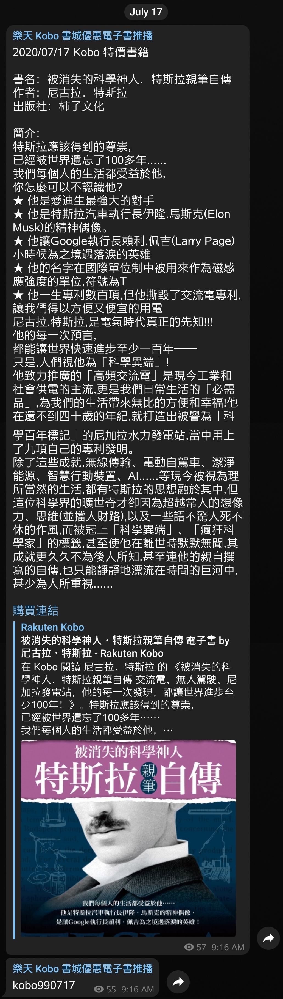

# 樂天 Kobo 書城一週 99 書單 Telegram 每日自動通知


# 簡介

- 台灣時區<u>**每周四**</u>上午 9:00 自動擷取最新樂天 Kobo 書城 Blog 一週99書單
- 自動抓取多個跨頁面之書籍資訊並將其自動提交至專案中
- 台灣時區<u>**每日**</u>上午 9:10 自動推播當日特價書籍至 Telegram 頻道
- **完全使用 GitHub Actions 服務，不需額外架設伺服器**


# 訊息格式

```
書名： {書名}
作者： {作者}
出版社： {出版社}
折扣碼資訊： {折扣碼資訊}
簡介： {簡介}
{購買連結}
{書籍封面}
```


# Telegram 頻道

[**Kobo 每周 99 優惠電子書推播功能**](https://web.telegram.org/#/im?p=@kobo_99_notifier)


# 推播內容截圖




# 軟體工程師最大謊言（ToDO）

- 新增相關測試以及錯誤處理

